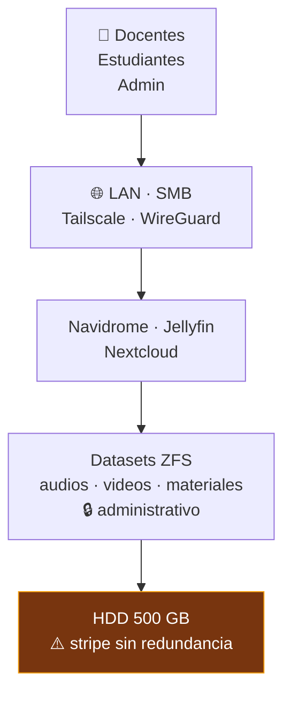

Cuando abrimos el gabinete, la PC tenía un procesador de 2011, una tarjeta gráfica muy antigua y quince años de uso continuo. Unas semanas después servía audio, video y documentos a través de una red cifrada, con snapshots automáticos y un dataset cifrado para datos personales.

Con un costo equivalente **S/. 880 en hardware** (unos USD 235) y **S/. 0 en licencias de software**.

Esto es lo que aprendimos construyéndolo — incluyendo las dos veces que nos quedamos mirando una biblioteca vacía sin entender por qué.

> **Antes de seguir:** este es un proyecto académico del curso _Cloud Computing y Continuidad_ de la carrera de Ingeniería de Sistemas Computacionales de la Universidad Privada del Norte. La academia de lengua quechua es un **cliente hipotético**: la infraestructura se implementó y probó para el curso, pero no hay un despliegue en producción.

---

## El problema no era técnico

Una academia que enseña quechua produce material todo el tiempo: audios de pronunciación, videoclases, diccionarios, fichas. Y también maneja lo aburrido pero delicado — matrículas con DNI, planillas, contratos.

Sin una plataforma central, eso vive donde puede: la laptop de un profesor o de un asistente administrativo, una memoria USB, el correo de alguien. Nadie sabe cuál es la última versión. Nadie tiene respaldo. Si el disco de esa laptop muere, muere también el material de años.

Para una institución cuyo activo principal **es** su material educativo, eso no es desorden: es riesgo operativo.

La restricción de partida era brutal y realista: **presupuesto cero**. Había que construirlo con lo que hubiera.

## Lo que había

| Componente | Descripción                                       |
| ---------- | ------------------------------------------------- |
| CPU        | Intel Core i3-2120 — 2 núcleos, 4 hilos, **2011** |
| RAM        | 16 GB DDR3 (sin ECC)                              |
| Discos     | SSD 240 GB + HDD 500 GB                           |
| GPU        | Nvidia GT 710                                     |

Sobre eso montamos TrueNAS Community Edition 25.10, un pool ZFS, tres aplicaciones (Navidrome para audio, Jellyfin para video, Nextcloud para documentos), snapshots automáticos, cifrado selectivo y acceso remoto por Tailscale.



Pero lo interesante no es la lista de componentes. Cualquiera instala TrueNAS siguiendo un tutorial. Lo interesante son las decisiones.

---

## Decisión 1: la GPU no se usa

Empezamos con una premisa equivocada. El equipo quería preservar la compatibilidad con el driver propietario de Nvidia, que funcionaba bien en AlmaLinux 9, bajo la idea de que _"las versiones nuevas de Linux son hostiles al driver propietario y fuerzan Nouveau con errores"_.

El diagnóstico era al revés. El problema no es que la GT 710 sea **demasiado nueva** para el sistema. Es que es **demasiado vieja**.

La GT 710 usa el chip GK208, arquitectura **Kepler**. Solo la soportan los drivers 470.xx legacy, que no compilan contra kernels 6.x. El problema existiría igual en Ubuntu 24.04 o en cualquier sistema moderno. Y como TrueNAS es un appliance cerrado, no puedes fijar manualmente una versión de driver: no está soportado y no sobrevive a las actualizaciones.

Todo eso resultó ser irrelevante.

**Un NAS es headless.** El monitor conectado al servidor solo muestra un menú de texto — el "Console setup", con opciones numeradas para configurar la red o reiniciar. Eso funciona con cualquier salida de video básica, sin driver acelerado. Toda la administración ocurre por interfaz web, desde otra computadora.

El único uso real del driver sería transcodificar video. Pero el NVENC de la GT 710 es inútil para eso. No es una limitación de software: es el silicio.

**Decisión: no usar la GPU.** Y si la placa tiene salida de video integrada, retirar la tarjeta directamente.

Descartar hardware con argumento resultó más valioso que agregarlo. Eliminamos una fuente completa de fallos y mantenimiento antes de que existiera.

## Decisión 2: Jellyfin solo en direct play

Esta se sigue de la anterior. Sin GPU utilizable y con un i3 de 2011, transcodificar por software habría saturado la CPU con un solo flujo de video, degradando de paso todo lo demás — SMB, Nextcloud, Navidrome.

Así que Jellyfin se configuró **exclusivamente en direct play**: el archivo se envía tal cual y el cliente lo decodifica. El servidor solo lee del disco y manda bytes por la red, que es justo lo que un NAS hace bien.

El costo: el cliente debe soportar el códec nativo, y no hay adaptación al ancho de banda. La consecuencia práctica es una **regla de ingesta**: todo video entra ya en H.264/AAC. La conversión la hace quien sube el archivo, en su propia máquina. El servidor no negocia.

Con esa regla, el i3-2120 sostuvo SMB, Navidrome, Jellyfin y Nextcloud simultáneamente sin despeinarse.

## Decisión 3: cifrar lo que importa, no todo

Aquí hay una restricción de ZFS que conviene conocer antes de necesitarla: **el cifrado se fija al crear el dataset**. No se activa después. No se desactiva. Se hereda de padre a hijo, nunca hacia arriba.

Cuando llegó el requisito de cifrado, nuestros datasets ya existían sin cifrar. La salida obvia era migrar todo. No lo hicimos.

Antes de aplicar el control, clasificamos el dato:

| Clase                 | Qué es                                                            | Decisión                                                                   |
| --------------------- | ----------------------------------------------------------------- | -------------------------------------------------------------------------- |
| Material educativo    | Audios, videos, diccionarios — licencia abierta o dominio público | **Sin cifrar.** Es información pública; cifrarla solo penaliza rendimiento |
| Datos administrativos | Matrículas, DNI, planillas, contratos                             | **Cifrado ZFS** desde la creación del dataset                              |

El fundamento no fue una preferencia técnica únicamente. Es la **Ley N.° 29733 de Protección de Datos Personales del Perú**: tratar datos personales obliga a adoptar medidas técnicas de protección. El cifrado no era opcional para esa clase de dato — y era innecesario para la otra.

Creamos `datos/administrativo` cifrado desde cero y lo montamos en Nextcloud como _External Storage_, restringido por grupo. Cero migración.

**¿Por qué ZFS y no el cifrado de Nextcloud?** Nextcloud tiene su propio módulo de _server-side encryption_, que sí puede activarse después. Pero ese cifrado tiene sentido cuando el almacenamiento **no está bajo tu control** — storage de terceros, nube ajena. Aquí el hardware está en la institución, así que la amenaza realista es el robo del disco, que es exactamente lo que cubre el cifrado en reposo de ZFS. El de Nextcloud penaliza rendimiento, complica los respaldos y arrastra un riesgo conocido: si se pierde la clave, los datos no vuelven.

Y una tensión que no resolvimos, porque no tiene solución limpia: **un dataset cifrado con passphrase no se monta solo al reiniciar**. Alguien tiene que desbloquearlo a mano. Automatizarlo con una keyfile guardada en el propio NAS anula buena parte de la protección — se robarían disco y llave juntos. No hay opción óptima; hay una decisión según el modelo de amenaza.

## Decisión 4: cuando el contrato define la arquitectura

Esta es mi favorita, porque el hallazgo no fue técnico.

El plan original era Tailscale para el acceso administrativo y **Cloudflare Tunnel** para los usuarios finales. Ambos atraviesan el CGNAT típico de una conexión doméstica peruana sin abrir puertos.

Investigando los términos, apareció el detalle. Cloudflare retiró en 2023 la famosa "Sección 2.8" de sus términos generales — pero **la movió a los Términos de Servicio Específicos del CDN**, donde sigue viva: servir video, o una proporción desproporcionada de audio y otro contenido no-HTML, está restringido fuera de los planes de pago, y el incumplimiento habilita a suspender el servicio.

Traducido: pasar streaming sostenido de Jellyfin y Navidrome por un túnel gratuito es precisamente lo que esa cláusula desalienta. Para una demo de cinco minutos no pasa nada. Como servicio permanente para una comunidad, expones la cuenta.

Así que la arquitectura de acceso **se bifurcó según el tipo de tráfico**:

- **Tailscale** para el administrador. Implementado y verificado: acceso al panel de TrueNAS y a las apps desde un cliente Ubuntu, con cero puertos expuestos. WireGuard cifra el transporte aunque la app hable HTTP plano.
- **Cloudflare Tunnel** para Nextcloud — tráfico de aplicación web, encaja con sus términos, y trae TLS válido de regalo.
- **Tailscale Funnel** para media — no pasa por el CDN de Cloudflare, así que no colisiona con la restricción.
  Una cláusula contractual terminó dibujando el diagrama. Evaluar el riesgo legal de un proveedor es parte del análisis de continuidad, igual que la tolerancia a fallos del hardware.

---

## Lo que salió mal

### La ruta que existía pero no existía

Instalando Navidrome, el formulario rechazaba la ruta:

```
Error: music Value error, Path does not exist
```

La ruta era `/mnt/datos/academia/audios`. Correcta. El dataset existía. La verifiqué tres veces.

El problema era que la **escribí a mano**. Al teclearla quedaba algún residuo invisible que el validador no aceptaba. La solución fue seleccionar la carpeta desde el árbol explorador que TrueNAS pone debajo del campo.

Regla nueva: en TrueNAS, las rutas se seleccionan, no se escriben.

### La biblioteca vacía

Este fue mejor. Navidrome instalado, estado _Running_, los MP3 visibles en el recurso SMB. Y la interfaz mostrando "Sin Álbumes todavía".

La causa: **las apps de TrueNAS no corren como el usuario dueño del dataset**. Corren como un usuario interno, **UID 568 (`apps`)**. Mi dataset pertenecía a `academia:academia`, y `apps` no tenía permiso de lectura. Navidrome estaba mirando una puerta cerrada.

Agregué la entrada ACL para `apps`. Guardé. Reinicié. Biblioteca vacía.

Y aquí estuvo el detalle que me costó entender: **no marqué "Apply permissions recursively"**. Sin recursividad, el permiso se aplicó a la **carpeta**, pero no a los archivos que ya estaban dentro. El flag `Inherit` solo afecta a los archivos nuevos. Navidrome podía ver la carpeta y no leer su contenido.

Bonus: el botón de recargar dentro de Navidrome solo refresca la página web. No reescanea nada. Hay que reiniciar el **contenedor**.

La regla que salió de ahí, y que aplicamos a cada app posterior:

> Toda app nueva que lea un dataset necesita: (1) ACL de lectura para `apps` (UID 568), (2) **aplicada recursivamente**, (3) reinicio del contenedor.

Dos horas de frustración condensadas en tres líneas. Vale lo que cuesta.

---

## Lo que quedó funcionando

- Almacenamiento centralizado en tres datasets SMB por tipo de contenido, con ingesta verificada desde Linux y Windows.
- Navidrome, Jellyfin y Nextcloud corriendo simultáneamente sobre el i3.
- Usuario de ingesta con **acceso solo SMB** — sin shell, sin SSH, sin panel de administración. Mínimo privilegio desde el primer día.
- Dataset administrativo cifrado, montado en Nextcloud con acceso restringido por grupo.
- Snapshots automáticos: diarios con retención de dos semanas, semanales con retención de dos meses.
- Acceso remoto por Tailscale, sin un solo puerto abierto en el router.
- Alineación documentada con ISO 27001 y con la Ley 29733.

---

## Lo que no resolvimos

Aquí es donde la mayoría de los posts de portafolio se callan. Prefiero no.

**El pool es un stripe de un solo disco.** Sin redundancia. TrueNAS lo advierte en rojo mientras lo creas: _"A stripe data VDEV is highly discouraged and will result in data loss if it fails"_. Aceptamos la advertencia conscientemente, porque el presupuesto era el que era y el objetivo era validar la arquitectura.

Pero conviene ser claro sobre lo que eso significa: **si ese HDD falla, se pierde todo**. Y todo lo demás de este post — el cifrado, las ACL, Tailscale, el mínimo privilegio — es irrelevante frente a ese escenario.

**Los snapshots no son un respaldo.** Viven en el mismo disco. Protegen contra borrado accidental y contra ransomware. No contra el fallo del dispositivo. Si el disco muere, los snapshots mueren con él. Es una confusión frecuente y vale la pena repetirla.

Falta la copia fuera de sitio para completar la regla **3-2-1**. Falta un mirror. Falta RAM ECC (el i3-2120 no la soporta). Falta TLS con certificados válidos. Falta el doble factor de autenticación (2FA). Y la cuenta de ingesta es compartida, así que no hay trazabilidad de quién subió qué.

Para un prototipo académico, era aceptable. Para producción con material real de una institución, **habría que solucionar esos asuntos pendientes**.

---

## Lo que me llevo

Tres cosas.

**La primera:** el trabajo difícil no fue instalar TrueNAS. Fue planificar previamente, ver qué **no** hacer en base a las restricciones— no usar la GPU, no transcodificar, no cifrarlo todo, no pasar media por Cloudflare. Cada una de esas negativas eliminó complejidad y riesgo antes de que existieran.

**La segunda:** las restricciones son el diseño. Presupuesto cero definió el hardware. El hardware definió direct play. Una limitación en términos y condiciones influyó en la topología de acceso remoto. Una limitación de ZFS definió cuándo había que decidir el cifrado. Fue necesario adaptarnos.

**La tercera, y la que más me sorprendió:** documentar lo que falta vale más que presumir lo que funciona. La versión honesta de este proyecto —con su disco único y su brecha de respaldo escrita en el diagrama de seguridad— es más útil, para mí y para quien lo lea, que una versión completa sin terminar.

---

_El repositorio completo, con las siete ADR, el runbook operativo, los diagramas y la documentación de seguridad, estarán en Github. Documentación bajo CC BY 4.0._
