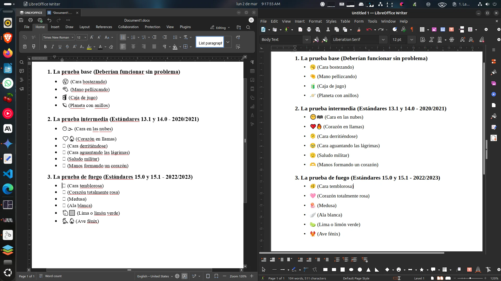

Las suites ofimáticas como LibreOffice, OnlyOffice y WPS Office necesitan las tipografías originales de Microsoft para mostrar correctamente documentos creados en Word, Excel y PowerPoint. Sin estas fuentes, el sistema usa sustituciones que alteran el formato, la paginación y la apariencia general de los documentos.

Por citar algunos ejemplos, los textos con Emoji en OnlyOffice se ven mal si es que no se tiene la tipografía Segoe UI Emoji. Similar es el caso de la tipografía Aptos, el cual es reemplazada de manera temporal con tipografías que no son "muy compatibles". Además, muchos sitios web de Microsoft (Outlook Web, Teams, SharePoint) usan Segoe UI como fuente principal, y sin ella instalada se ven con tipografías genéricas y pixeladas.



_OnlyOffice en un Ubuntu 24.04 que no tiene tipografía Segoe UI Emoji. Los emojis de las últimas versiones de Unicode aparece como cuadrados. Eso no sucede con LibreOffice, pues para los emojis usa la tipografia Noto Emoji de Google_

El paquete `ttf-mscorefonts-installer` de algunas distribuciones Linux como Ubuntu instala las Core Fonts for the Web (Arial, Times New Roman, Courier New, etc.) en su versión del año 2002, pero **no incluye** las fuentes ClearType (Calibri, Cambria, etc.), ni Segoe UI, ni Aptos, ni ninguna fuente posterior a 2002. AlmaLinux y otras distros basadas en RHEL no tienen un equivalente directo en sus repositorios, lo que fuerza a buscar en repositorios de terceros. Por eso la extracción manual es necesaria.

## Contexto del procedimiento

Este procedimiento fue realizado en una máquina con dual-boot Ubuntu 24.04 + Windows 11 24H2, donde Windows está instalado en un SSD secundario (`/dev/sda1`). Las fuentes de Office 2024 (familia Aptos y extras) se extrajeron desde una máquina virtual de Windows 10 22H2 con Office 2024, gestionada con Libvirt/QEMU y usada a través de WinApps.

## Resumen del proceso

1. Desactivar Fast Startup en Windows 11.
2. Resolver el flag "dirty" de la partición NTFS con `chkdsk`.
   .3. Montar la partición de Windows y copiar las fuentes desde Linux.
3. Organizar las fuentes en carpetas por familia tipográfica
4. Extraer las fuentes de Office 2024 desde la VM (Aptos y extras)
5. Renombrar las cloud fonts de Office (nombres numéricos → nombres legibles)
6. Instalar las fuentes en Linux

## Estructura final de carpetas

```
fuentes-windows/
│
├── 01-cleartype/               ← ClearType Collection (Vista/7/8.1)
│   │                              Introducidas con Windows Vista, son las fuentes
│   │                              predeterminadas de Office 2007–2019.
│   ├── Calibri-Regular.ttf
│   ├── Calibri-Bold.ttf
│   ├── Calibri-Italic.ttf
│   ├── Calibri-Bold_Italic.ttf
│   ├── Calibri-Light.ttf
│   ├── Calibri-Light_Italic.ttf
│   ├── Cambria-Regular.ttc        (incluye Cambria Math)
│   ├── Cambria-Bold.ttf
│   ├── Cambria-Italic.ttf
│   ├── Cambria-Bold_Italic.ttf
│   ├── Candara-Regular.ttf        (+Bold, Italic, Light y variantes)
│   ├── Consolas-Regular.ttf       (+Bold, Italic, Bold Italic)
│   ├── Constantia-Regular.ttf     (+Bold, Italic, Bold Italic)
│   └── Corbel-Regular.ttf         (+Bold, Italic, Light y variantes)
│
├── 02-core-fonts/              ← Core Fonts for the Web (las clásicas de Microsoft)
│   │                              Las fuentes web originales de la década de 1990/2000.
│   ├── Arial-Regular.ttf          (+Bold, Italic, Bold Italic)
│   ├── Arial-Black.ttf
│   ├── Comic_Sans_MS-Regular.ttf  (+Bold, Italic, Bold Italic)
│   ├── Courier_New-Regular.ttf    (+Bold, Italic, Bold Italic)
│   ├── Georgia-Regular.ttf        (+Bold, Italic, Bold Italic)
│   ├── Impact-Regular.ttf
│   ├── Times_New_Roman-Regular.ttf (+Bold, Italic, Bold Italic)
│   ├── Trebuchet_MS-Regular.ttf   (+Bold, Italic, Bold Italic)
│   ├── Verdana-Regular.ttf        (+Bold, Italic, Bold Italic)
│   ├── Webdings-Regular.ttf
│   ├── Wingdings-Regular.ttf
│   └── Symbol-Regular.ttf
│
├── 03-segoe/                   ← Familia Segoe (interfaz de Windows y web de MS)
│   │                              Fuente del sistema en Windows 7–11 y servicios
│   │                              web de Microsoft (Outlook, Teams, SharePoint).
│   ├── Segoe_UI-Regular.ttf
│   ├── Segoe_UI-Bold.ttf
│   ├── Segoe_UI-Italic.ttf
│   ├── Segoe_UI-Bold_Italic.ttf
│   ├── Segoe_UI-Light.ttf
│   ├── Segoe_UI-Semilight.ttf
│   ├── Segoe_UI-Semibold.ttf
│   ├── Segoe_UI-Black.ttf
│   ├── Segoe_UI_Symbol-Regular.ttf
│   ├── Segoe_UI_Emoji-Regular.ttf
│   ├── Segoe_UI_Historic-Regular.ttf
│   ├── Segoe_Print-Regular.ttf    (+Bold)
│   ├── Segoe_Script-Regular.ttf   (+Bold)
│   ├── Segoe_MDL2_Assets-Regular.ttf
│   ├── Segoe_Fluent_Icons-Regular.ttf
│   └── Segoe_UI_Variable-Regular.ttf
│
├── 04-windows-modernas/        ← Fuentes nuevas de Windows 10/11
│   ├── Bahnschrift-Regular.ttf    (variable, estilo DIN)
│   ├── Gadugi-Regular.ttf         (+Bold)
│   ├── Leelawadee_UI-Regular.ttf  (+Bold, Semilight)
│   ├── Malgun_Gothic-Regular.ttf  (+Bold, Semilight)
│   ├── Nirmala_UI-Regular.ttc     (+Bold, Semilight)
│   ├── Sitka-Regular.ttf          (variable, +Italic)
│   ├── Ink_Free-Regular.ttf
│   ├── Gabriola-Regular.ttf
│   └── SansSerifCollection.ttf
│
├── 05-clasicas-windows/        ← Fuentes clásicas del sistema Windows
│   ├── Tahoma-Regular.ttf         (+Bold)
│   ├── Lucida_Console-Regular.ttf
│   ├── Palatino_Linotype-Regular.ttf (+Bold, Italic, Bold Italic)
│   ├── Microsoft_Sans_Serif-Regular.ttf
│   ├── Ebrima-Regular.ttf         (+Bold)
│   ├── Franklin_Gothic_Medium-Regular.ttf (+Italic)
│   ├── Sylfaen-Regular.ttf
│   ├── Marlett-Regular.ttf
│   ├── MV_Boli-Regular.ttf
│   ├── Microsoft_PhagsPa-Regular.ttf (+Bold)
│   ├── Microsoft_Himalaya-Regular.ttf
│   ├── Microsoft_New_Tai_Lue-Regular.ttf (+Bold)
│   ├── Microsoft_Tai_Le-Regular.ttf (+Bold)
│   └── ...y otras
│
├── 06-multilingue/             ← Fuentes CJK y multilingüe
│   ├── MS_Gothic-Regular.ttc      (MS Gothic / MS PGothic / MS UI Gothic)
│   ├── Microsoft_YaHei-Regular.ttc (+Bold, Light)
│   ├── Microsoft_JhengHei-Regular.ttc (+Bold, Light)
│   ├── Yu_Gothic-Regular.ttc      (+Bold, Light, Medium)
│   ├── SimSun-Regular.ttc         (SimSun / NSimSun)
│   ├── SimSun-ExtG.ttf
│   ├── MingLiU-Regular.ttc
│   └── Microsoft_Yi_Baiti-Regular.ttf
│
├── 07-aptos-office2024/        ← Nuevas fuentes predeterminadas de Office 2024
│   │                              Extraídas de la caché de CloudFonts de Office
│   ├── Aptos-Regular.ttf
│   ├── Aptos-Bold.ttf
│   ├── Aptos-Italic.ttf
│   ├── Aptos-Bold_Italic.ttf
│   ├── Aptos-Display.ttf
│   ├── Aptos-Display_Bold.ttf
│   ├── Aptos-Display_Italic.ttf
│   ├── Aptos-Display_Bold_Italic.ttf
│   ├── Aptos_Narrow-Regular.ttf
│   ├── Aptos_Narrow-Bold.ttf
│   ├── Aptos_Narrow-Italic.ttf
│   └── Aptos_Narrow-Bold_Italic.ttf
│
├── 08-otras/                   ← Fuentes de Windows no categorizadas
│
├── 09-office-extras/           ← Fuentes exclusivas de Office 2024
│   │                              No vienen con Windows 11, solo con Office.
│   │                              Incluye fuentes de la carpeta privada de Office
│   │                              y cloud fonts clásicas adicionales.
│   │
│   │  --- Desde la carpeta privada de Office ---
│   ├── Arial_Narrow-Regular.ttf   (+Bold, Italic, Bold Italic)
│   ├── Book_Antiqua-Regular.ttf   (+Bold, Italic, Bold Italic)
│   ├── Bookman_Old_Style-Regular.ttf (+Bold, Italic, Bold Italic)
│   ├── Century-Regular.ttf
│   ├── Century_Gothic-Regular.ttf (+Bold, Italic, Bold Italic)
│   ├── Dubai-Regular.ttf          (+Bold, Light, Medium)
│   ├── Garamond-Regular.ttf       (+Bold, Italic)
│   ├── Haettenschweiler-Regular.ttf
│   ├── Bradley_Hand_ITC-Regular.ttf
│   ├── Lucida_Handwriting-Regular.ttf
│   ├── Mistral-Regular.ttf
│   ├── Monotype_Corsiva-Regular.ttf
│   ├── French_Script_MT-Regular.ttf
│   ├── Freestyle_Script-Regular.ttf
│   ├── Pristina-Regular.ttf
│   ├── Papyrus-Regular.ttf
│   ├── Wingdings_2-Regular.ttf
│   ├── Wingdings_3-Regular.ttf
│   ├── MT_Extra-Regular.ttf
│   ├── Outlook-Regular.ttf        (iconos de Outlook)
│   │
│   │  --- Desde CloudFonts de Office ---
│   ├── Rockwell-Regular.ttf       (+Bold)
│   ├── Gill_Sans_MT-Regular.ttf
│   ├── Calisto_MT-Regular.ttf
│   ├── Century_Schoolbook-Regular.ttf
│   ├── Tw_Cen_MT-Regular.ttf      (+Bold)
│   └── Agency_FB-Regular.ttf
│
├── organizar-fuentes.sh
└── README.md
```

> **Nota:** Los nombres de archivo mostrados corresponden al formato renombrado con `fc-query`. Los nombres originales de Windows usan abreviaciones como `calibri.ttf`, `arialbd.ttf`, etc. Los archivos de CloudFonts de Office vienen con nombres numéricos como `26205970649.ttf` que se renombran en el Paso 6.

---

## Paso 1: Desactivar Fast Startup en Windows 11 24H2

Windows 11 activa por defecto "Inicio rápido" (Fast Startup), que deja la partición NTFS en estado de hibernación parcial, impidiendo que Linux monte esa partición. El síntoma típico es el error `wrong fs type, bad option, bad superblock` al intentar acceder a la partición de Windows desde Linux.

Abrir **PowerShell como Administrador** en Windows y ejecutar:

```powershell
powercfg /h off
```

Esto desactiva la hibernación por completo, lo cual elimina Fast Startup (ya que depende del archivo de hibernación `hiberfil.sys`).

Luego apagar completamente (el apagado debería demorar más de lo normal, lo cual es buena señal de que está haciendo un apagado real):

```powershell
shutdown /s /f /t 0
```

> **Importante:** Usar siempre "Apagar" (`shutdown /s`). No usar "Reiniciar", ya que "Apagar" y "Reiniciar" se comportan de forma diferente en Windows 10/11 respecto al cierre del kernel.

## Paso 2: Resolver el flag "dirty" de la partición NTFS

Aun después de desactivar Fast Startup, es posible que la partición NTFS esté marcada como "sucia" (dirty) por un apagado previo que no fue limpio. En ese caso, al intentar montar desde Linux, aparecerá el mismo error genérico en el explorador de archivos.

Para diagnosticar, ejecutar desde Linux:

```bash
sudo dmesg | grep ntfs3
```

Si aparece el mensaje `ntfs3(sda1): volume is dirty and "force" flag is not set!`, la solución es ejecutar `chkdsk` desde Windows.

Arrancar Windows y abrir **CMD como Administrador**:

```cmd
chkdsk C: /f
```

Windows dirá que no puede examinar la partición en uso y la programará para el siguiente reinicio. Aceptar, reiniciar, dejar que complete la verificación (puede tomar varios minutos), y después apagar completamente:

```powershell
shutdown /s /f /t 0
```

Al volver a Linux, verificar que el flag dirty desapareció:

```bash
sudo dmesg | grep ntfs3
```

Si ya no aparece "volume is dirty", la partición está lista para montar.

> **Alternativa rápida desde Linux** (menos segura, pero funcional para solo lectura):
>
> ```bash
> sudo ntfsfix /dev/sda1
> ```

## Paso 3: Montar la partición de Windows y copiar las fuentes

Identificar la partición de Windows:

```bash
lsblk -f
```

En nuestro caso, Windows 11 está en `/dev/sda1` (SSD Crucial CT480BX500SSD1, una sola partición NTFS de 447 GB).

```bash
# Montar la partición en modo solo lectura
sudo mkdir -p /mnt/windows
sudo mount -t ntfs3 -o ro /dev/sda1 /mnt/windows

# Copiar todas las fuentes a un directorio de trabajo
mkdir -p ~/fuentes-windows
cp /mnt/windows/Windows/Fonts/*.ttf ~/fuentes-windows/
cp /mnt/windows/Windows/Fonts/*.ttc ~/fuentes-windows/
cp /mnt/windows/Windows/Fonts/*.otf ~/fuentes-windows/ 2>/dev/null

# Desmontar
sudo umount /mnt/windows
```

> Si `ntfs3` no funciona, instalar y usar `ntfs-3g` como alternativa:
>
> ```bash
> sudo apt install ntfs-3g
> sudo mount -t ntfs-3g -o ro /dev/sda1 /mnt/windows
> ```

## Paso 4: Organizar las fuentes por familia tipográfica

Este es el script que clasifica las tipografías por familias

```bash
#!/bin/bash
# ============================================================================
# organizar-fuentes.sh
# Organiza las tipografías ya extraídas en carpetas por familia tipográfica
#
# Uso: bash organizar-fuentes.sh [directorio_fuentes]
# Por defecto usa: ~/fuentes-windows
# ============================================================================

set -euo pipefail

DEST="${1:-$HOME/fuentes-windows}"

GREEN='\033[0;32m'
BLUE='\033[0;34m'
NC='\033[0m'

log_info()  { echo -e "${GREEN}[INFO]${NC} $1"; }
log_step()  { echo -e "${BLUE}[PASO]${NC} $1"; }

if [ ! -d "$DEST" ]; then
    echo "Error: No se encontró el directorio $DEST"
    exit 1
fi

# Crear carpetas de categorías
log_step "Creando estructura de carpetas..."
mkdir -p "$DEST"/{01-cleartype,02-core-fonts,03-segoe,04-windows-modernas,05-clasicas-windows,06-multilingue,07-aptos-office2024,08-otras}

# Función para mover archivos por patrón (case-insensitive)
mover() {
    local patron="$1"
    local carpeta="$2"
    for f in "$DEST"/$patron; do
        [ -f "$f" ] || continue
        mv "$f" "$DEST/$carpeta/" 2>/dev/null || true
    done
}

mover_i() {
    # Mover usando find case-insensitive para un patrón dado
    local patron="$1"
    local carpeta="$2"
    find "$DEST" -maxdepth 1 -type f -iname "$patron" -exec mv {} "$DEST/$carpeta/" \; 2>/dev/null || true
}

# === 01-cleartype: ClearType Collection (Vista/7/8.1) ===
log_step "Clasificando ClearType Collection..."
mover_i "calibri*" "01-cleartype"
mover_i "cambria*" "01-cleartype"
mover_i "candara*" "01-cleartype"
mover_i "consola*" "01-cleartype"
mover_i "constan*" "01-cleartype"
mover_i "corbel*" "01-cleartype"

# === 02-core-fonts: Core Fonts for the Web ===
log_step "Clasificando Core Fonts..."
mover_i "arial*" "02-core-fonts"
mover_i "ariblk*" "02-core-fonts"
mover_i "comic*" "02-core-fonts"
mover_i "cour*" "02-core-fonts"
mover_i "georgia*" "02-core-fonts"
mover_i "impact*" "02-core-fonts"
mover_i "times*" "02-core-fonts"
mover_i "trebuc*" "02-core-fonts"
mover_i "verdana*" "02-core-fonts"
mover_i "webdings*" "02-core-fonts"
mover_i "wingding*" "02-core-fonts"
mover_i "symbol*" "02-core-fonts"

# === 03-segoe: Familia Segoe ===
log_step "Clasificando familia Segoe..."
mover_i "segoe*" "03-segoe"
mover_i "segui*" "03-segoe"
mover_i "segmdl*" "03-segoe"
mover_i "SegUIVar*" "03-segoe"
mover_i "SegoeIcons*" "03-segoe"

# === 04-windows-modernas: Windows 10/11 ===
log_step "Clasificando fuentes modernas de Windows 10/11..."
mover_i "bahnschrift*" "04-windows-modernas"
mover_i "cascadia*" "04-windows-modernas"
mover_i "gadugi*" "04-windows-modernas"
mover_i "Leela*" "04-windows-modernas"
mover_i "LeeUI*" "04-windows-modernas"
mover_i "malgun*" "04-windows-modernas"
mover_i "nirmala*" "04-windows-modernas"
mover_i "sitka*" "04-windows-modernas"
mover_i "SansSerifCollection*" "04-windows-modernas"
mover_i "Inkfree*" "04-windows-modernas"
mover_i "Gabriola*" "04-windows-modernas"

# === 05-clasicas-windows: Clásicas de Windows ===
log_step "Clasificando fuentes clásicas..."
mover_i "tahoma*" "05-clasicas-windows"
mover_i "lucon*" "05-clasicas-windows"
mover_i "pala*" "05-clasicas-windows"
mover_i "micross*" "05-clasicas-windows"
mover_i "ebrima*" "05-clasicas-windows"
mover_i "framd*" "05-clasicas-windows"
mover_i "sylfaen*" "05-clasicas-windows"
mover_i "marlett*" "05-clasicas-windows"
mover_i "mvboli*" "05-clasicas-windows"
mover_i "phag*" "05-clasicas-windows"
mover_i "javatext*" "05-clasicas-windows"
mover_i "himalaya*" "05-clasicas-windows"
mover_i "ntailu*" "05-clasicas-windows"
mover_i "taile*" "05-clasicas-windows"
mover_i "monbaiti*" "05-clasicas-windows"
mover_i "mmrtext*" "05-clasicas-windows"
mover_i "l_10646*" "05-clasicas-windows"

# === 06-multilingue: CJK y multilingüe ===
log_step "Clasificando fuentes multilingüe/CJK..."
mover_i "msgothic*" "06-multilingue"
mover_i "msmincho*" "06-multilingue"
mover_i "meiryo*" "06-multilingue"
mover_i "YuGoth*" "06-multilingue"
mover_i "simsun*" "06-multilingue"
mover_i "SimsunExtG*" "06-multilingue"
mover_i "simhei*" "06-multilingue"
mover_i "msyh*" "06-multilingue"
mover_i "msyi*" "06-multilingue"
mover_i "msjh*" "06-multilingue"
mover_i "mingliub*" "06-multilingue"

# === 07-aptos-office2024: Se llenarán desde la VM ===
log_step "Clasificando familia Aptos (si existe)..."
mover_i "aptos*" "07-aptos-office2024"

# === 08-otras: Todo lo que no se clasificó ===
log_step "Moviendo fuentes restantes a 08-otras..."
find "$DEST" -maxdepth 1 -type f \( -iname "*.ttf" -o -iname "*.ttc" -o -iname "*.otf" \) -exec mv {} "$DEST/08-otras/" \; 2>/dev/null || true

# === RESUMEN ===
echo ""
echo "============================================="
echo "  RESUMEN DE CLASIFICACIÓN"
echo "============================================="
echo ""

total=0
for carpeta in $(find "$DEST" -mindepth 1 -maxdepth 1 -type d | sort); do
    nombre=$(basename "$carpeta")
    count=$(find "$carpeta" -type f \( -iname "*.ttf" -o -iname "*.ttc" -o -iname "*.otf" \) 2>/dev/null | wc -l)
    total=$((total + count))
    if [ "$count" -gt 0 ]; then
        printf "  %-30s %3d fuentes\n" "$nombre/" "$count"
    else
        printf "  %-30s     (vacía)\n" "$nombre/"
    fi
done

echo ""
echo "  Total: $total fuentes clasificadas"
echo "============================================="
echo ""

# Eliminar carpetas vacías (excepto 07-aptos que se llenará después)
for carpeta in "$DEST"/08-otras; do
    if [ -d "$carpeta" ] && [ -z "$(ls -A "$carpeta")" ]; then
        rmdir "$carpeta"
        log_info "Eliminada carpeta vacía: $(basename "$carpeta")"
    fi
done

log_info "¡Clasificación completada!"
log_info "Resultado en: $DEST/"
echo ""
echo "Siguiente paso: extraer fuentes Aptos de la VM de Windows 10"
echo "  Consulta el README.md para instrucciones detalladas."
echo ""
```

Ejecutar el script de organización:

```bash
bash organizar-fuentes.sh ~/fuentes-windows
```

El script clasifica automáticamente cada fuente en las carpetas `01-cleartype/` a `08-otras/` según patrones de nombre de archivo. Las fuentes que no coincidan con ninguna categoría se mueven a `08-otras/`.

## Paso 5: Extraer fuentes de Office 2024 desde la VM

Office 2024 (y Microsoft 365) almacena sus fuentes en ubicaciones diferentes a `C:\Windows\Fonts`. Es necesario buscar en dos lugares.

### 5a: Fuentes privadas de Office

Estas son fuentes exclusivas de Office que no vienen con Windows 11 (Arial Narrow, Garamond, Century Gothic, Bookman, Wingdings 2/3, etc.):

```
C:\Program Files\Microsoft Office\root\vfs\Fonts\private\
```

Si Office es de 32 bits:

```
C:\Program Files (x86)\Microsoft Office\root\vfs\Fonts\private\
```

Desde la VM, copiar todo el contenido de esa carpeta a una carpeta compartida con el host.

### 5b: Fuentes CloudFonts (Aptos y otras)

Office 2024 maneja la familia Aptos como **cloud font** que se descarga bajo demanda. Estas fuentes no están en `C:\Windows\Fonts` ni en la carpeta privada de Office, sino en la caché del usuario:

```
C:\Users\<tu_usuario>\AppData\Local\Microsoft\FontCache\4\CloudFonts\
```

Esta carpeta contiene subcarpetas con el nombre de cada familia tipográfica (Aptos, Aptos Display, Aptos Narrow, etc.), y dentro de cada una hay archivos `.ttf` con **nombres numéricos** (por ejemplo `26205970649.ttf`). Estos nombres numéricos se renombrarán en el Paso 6.

Para copiar las fuentes relevantes desde CMD en la VM:

```cmd
mkdir "%USERPROFILE%\Desktop\cloud-fonts"

xcopy "%LOCALAPPDATA%\Microsoft\FontCache\4\CloudFonts\Aptos" "%USERPROFILE%\Desktop\cloud-fonts\Aptos\" /E
xcopy "%LOCALAPPDATA%\Microsoft\FontCache\4\CloudFonts\Aptos Display" "%USERPROFILE%\Desktop\cloud-fonts\Aptos Display\" /E
xcopy "%LOCALAPPDATA%\Microsoft\FontCache\4\CloudFonts\Aptos Narrow" "%USERPROFILE%\Desktop\cloud-fonts\Aptos Narrow\" /E
xcopy "%LOCALAPPDATA%\Microsoft\FontCache\4\CloudFonts\Rockwell" "%USERPROFILE%\Desktop\cloud-fonts\Rockwell\" /E
xcopy "%LOCALAPPDATA%\Microsoft\FontCache\4\CloudFonts\Gill Sans MT" "%USERPROFILE%\Desktop\cloud-fonts\Gill Sans MT\" /E
xcopy "%LOCALAPPDATA%\Microsoft\FontCache\4\CloudFonts\Calisto MT" "%USERPROFILE%\Desktop\cloud-fonts\Calisto MT\" /E
xcopy "%LOCALAPPDATA%\Microsoft\FontCache\4\CloudFonts\Century Schoolbook" "%USERPROFILE%\Desktop\cloud-fonts\Century Schoolbook\" /E
xcopy "%LOCALAPPDATA%\Microsoft\FontCache\4\CloudFonts\Tw Cen MT" "%USERPROFILE%\Desktop\cloud-fonts\Tw Cen MT\" /E
xcopy "%LOCALAPPDATA%\Microsoft\FontCache\4\CloudFonts\Agency FB" "%USERPROFILE%\Desktop\cloud-fonts\Agency FB\" /E
```

Luego transferir las carpetas al host vía carpeta compartida de Libvirt/WinApps.

> **Nota:** La carpeta CloudFonts puede contener también fuentes de Google Fonts (Barlow, Nunito, PT Sans, Raleway) que Office descargó al abrir documentos. Estas se pueden ignorar ya que son fácilmente instalables desde Google Fonts directamente.

### 5c: Mover las fuentes al directorio organizado en Linux

```bash
# Crear carpeta para extras de Office
mkdir -p ~/fuentes-windows/09-office-extras

# Mover las cloud fonts de Aptos a su carpeta
mv ~/ruta-cloud-fonts/Aptos/*.ttf ~/fuentes-windows/07-aptos-office2024/
mv ~/ruta-cloud-fonts/Aptos\ Display/*.ttf ~/fuentes-windows/07-aptos-office2024/
mv ~/ruta-cloud-fonts/Aptos\ Narrow/*.ttf ~/fuentes-windows/07-aptos-office2024/

# Mover las cloud fonts adicionales a office-extras
mv ~/ruta-cloud-fonts/Rockwell/*.ttf ~/fuentes-windows/09-office-extras/
mv ~/ruta-cloud-fonts/Gill\ Sans\ MT/*.ttf ~/fuentes-windows/09-office-extras/
mv ~/ruta-cloud-fonts/Calisto\ MT/*.ttf ~/fuentes-windows/09-office-extras/
mv ~/ruta-cloud-fonts/Century\ Schoolbook/*.ttf ~/fuentes-windows/09-office-extras/
mv ~/ruta-cloud-fonts/Tw\ Cen\ MT/*.ttf ~/fuentes-windows/09-office-extras/
mv ~/ruta-cloud-fonts/Agency\ FB/*.ttf ~/fuentes-windows/09-office-extras/

# Mover las fuentes de la carpeta privada de Office a office-extras
mv ~/ruta-fuentes-privadas/*.ttf ~/fuentes-windows/09-office-extras/
mv ~/ruta-fuentes-privadas/*.TTF ~/fuentes-windows/09-office-extras/
```

## Paso 6: Renombrar fuentes con nombres numéricos

Los archivos de CloudFonts tienen nombres numéricos (como `26205970649.ttf`). Para renombrarlos al nombre real de la fuente, se usa `fc-query` que lee los metadatos internos del archivo:

```bash
for carpeta in 07-aptos-office2024 09-office-extras; do
    cd ~/fuentes-windows/$carpeta
    for f in *.ttf *.TTF; do
        [ -f "$f" ] || continue
        nombre=$(fc-query --format="%{family[0]}-%{style[0]}" "$f" | head -1 | tr ' ' '_')
        if [ -n "$nombre" ]; then
            mv "$f" "${nombre}.ttf"
            echo "$f -> ${nombre}.ttf"
        fi
    done
done
```

Este comando también funciona para renombrar las fuentes de Windows (carpetas 01 a 06) si se desea uniformar los nombres:

```bash
for carpeta in ~/fuentes-windows/*/; do
    cd "$carpeta"
    for f in *.ttf *.TTF *.ttc *.TTC; do
        [ -f "$f" ] || continue
        nombre=$(fc-query --format="%{family[0]}-%{style[0]}" "$f" | head -1 | tr ' ' '_')
        if [ -n "$nombre" ]; then
            ext="${f##*.}"
            mv "$f" "${nombre}.${ext,,}"
            echo "$(basename "$carpeta"): $f -> ${nombre}.${ext,,}"
        fi
    done
done
```

> **Nota:** El renombrado es opcional y puramente organizativo. Linux identifica las fuentes por sus metadatos internos, no por el nombre del archivo. Las fuentes funcionan igual con cualquier nombre.

## Paso 7: Instalar las fuentes en Linux

El procedimiento es el mismo en Ubuntu 24.04, Ubuntu 22.04, AlmaLinux 9, Fedora, Debian y cualquier distribución que use `fontconfig`.

### Para todos los usuarios del sistema (recomendado)

```bash
sudo mkdir -p /usr/local/share/fonts/windows
sudo cp -r ~/fuentes-windows/*/ /usr/local/share/fonts/windows/
sudo fc-cache -fv
```

### Para el usuario actual solamente

```bash
mkdir -p ~/.local/share/fonts/windows
cp -r ~/fuentes-windows/*/ ~/.local/share/fonts/windows/
fc-cache -fv
```

> Se recomienda elegir una de las dos opciones, no ambas. La instalación a nivel de sistema es preferible si hay múltiples usuarios en el equipo. Si se instalan en ambas ubicaciones, no hay conflictos: `fontconfig` simplemente ignora los duplicados.

### En AlmaLinux 9 / RHEL

Si `fontconfig` no está instalado (raro, pero posible):

```bash
sudo dnf install fontconfig
```

El resto del procedimiento es idéntico.

### Verificación

```bash
# Fuentes ClearType
fc-list | grep -i "calibri"
fc-list | grep -i "cambria"

# Segoe UI
fc-list | grep -i "segoe"

# Aptos (Office 2024)
fc-list | grep -i "aptos"

# Core Fonts
fc-list | grep -i "arial"
fc-list | grep -i "times new roman"

# Office extras
fc-list | grep -i "garamond"
fc-list | grep -i "arial narrow"
```

Después de instalar, reiniciar las aplicaciones para que detecten las nuevas fuentes. LibreOffice a veces requiere cerrar completamente el proceso en segundo plano:

```bash
killall soffice.bin 2>/dev/null
```

## Compatibilidad por aplicación

| Aplicación     | Resultado esperado                                                                 |
| -------------- | ---------------------------------------------------------------------------------- |
| LibreOffice    | Documentos .docx/.xlsx/.pptx se muestran con las fuentes correctas                 |
| OnlyOffice     | Compatibilidad completa con documentos de Microsoft Office                         |
| WPS Office     | Ya incluye algunas fuentes de Microsoft; las adicionales mejoran la compatibilidad |
| Firefox/Chrome | Sitios de Microsoft (Outlook, Teams Web) se ven correctamente                      |
| Inkscape/GIMP  | Las fuentes quedan disponibles para diseño gráfico                                 |

## Fuentes más importantes por caso de uso

**Para documentos de Office:** Calibri (predeterminada Office 2007–2023), Aptos (predeterminada Office 2024), Times New Roman (documentos académicos y formales), Arial (sans-serif muy usada), Arial Narrow (tablas y CVs), Garamond y Century Gothic (documentos corporativos).

**Para interfaces web de Microsoft:** Segoe UI (fuente de la interfaz de Windows y de todos los servicios web de Microsoft).

**Para programación:** Consolas (monoespaciada clásica de Microsoft). Cascadia Code/Mono es la alternativa moderna pero no viene preinstalada en Windows 11; se instala con Windows Terminal.

## Notas legales

Las tipografías de Microsoft están protegidas por derechos de autor. Esta extracción es para uso personal en máquinas donde ya se posee una licencia válida de Windows y/o Microsoft Office. No redistribuir las fuentes a terceros.

## Solución de problemas

**La partición de Windows no se monta (error "wrong fs type, bad superblock"):**
Puede ser Fast Startup activo o el flag dirty del filesystem. Verificar con `sudo dmesg | grep ntfs3`. Si dice "volume is dirty", ejecutar `chkdsk C: /f` desde Windows (ver Paso 2). Si nunca se desactivó Fast Startup, ejecutar `powercfg /h off` desde PowerShell como Administrador en Windows (ver Paso 1).

**La partición no es BitLocker pero sigue sin montar:**
Windows 11 24H2 puede activar cifrado de dispositivo automáticamente. Verificar con `sudo blkid /dev/sda1`: si muestra `TYPE="BitLocker"` en vez de `TYPE="ntfs"`, hay que desactivar el cifrado desde Windows (Configuración → Privacidad y seguridad → Cifrado del dispositivo). Si muestra `NTFS` y `sudo hexdump -C -n 16 /dev/sda1` muestra la cadena `NTFS` (y no `-FVE-FS-`), no es BitLocker.

**Las fuentes Aptos no están en C:\Windows\Fonts de la VM:**
Office 2024 no instala Aptos en la carpeta de fuentes del sistema. Las descarga como cloud fonts y las almacena en `%LOCALAPPDATA%\Microsoft\FontCache\4\CloudFonts\`. Ver Paso 5b.

**Los archivos de CloudFonts tienen nombres numéricos:**
Es normal. Office usa identificadores numéricos para su caché. Se renombran con `fc-query` (ver Paso 6).

**Las fuentes no aparecen en las aplicaciones después de instalar:**
Ejecutar `fc-cache -fv` y reiniciar la aplicación. Verificar con `fc-list | grep -i "nombre_fuente"`. LibreOffice puede necesitar `killall soffice.bin` para cerrarse completamente.

**Fuentes duplicadas (instaladas en dos ubicaciones):**
No causa problemas. `fontconfig` identifica las fuentes por sus metadatos internos, no por la ruta ni el nombre del archivo. Si hay duplicados, simplemente usa una y la otra queda ignorada.


_LibreOffice con la tipografía Aptos de Microsoft Office 2024. Ahora se ve correctamente._


_OnlyOffice en un Ubuntu 24.04 que que si tiene tipografía Segoe UI Emoji. Los emojis funcionan aunque salen como monocromáticos ya que no puede leer la información de colores degradados_

---

_Guía elaborada en marzo 2026. Probada en Ubuntu 24.04 con Windows 11 24H2 instalado en otra partición; y Office 2024 en un Windows 10 22H2 en VM Libvirt/QEMU._
